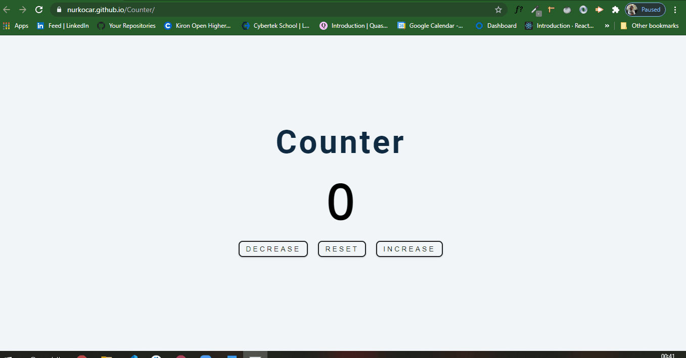
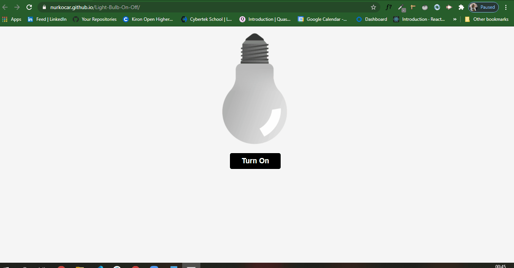
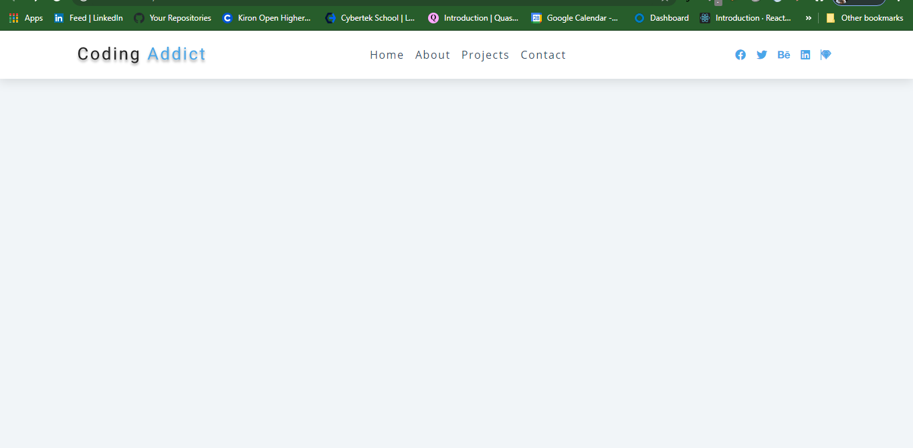
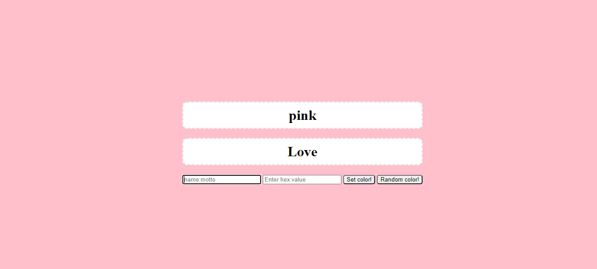

 
  
<h1 align="center">Index of Vanilla JavaScript Projects</h1>

<table>
    <thead>
        <tr>
            <td>Project Name</td>
            <td>Repo Link</td>
            <td>App Link</td>
            <td>Overview</td>
        </tr>
    </thead>
    <tbody> 
        <tr>
            <td>Guess The Number</td>
            <td><a href="https://github.com/nurkocar/Guess-My-Number" target="_blank">Repo details</a></td>
            <td><a href="https://nurkocar.github.io/Guess-My-Number/" target="_blank">Click here to see the project</a></td>
            <td></td> 
        </tr>
        <tr>
            <td>Calculator</td>
            <td><a href="https://github.com/nurkocar/Calculator" target="_blank">Repo details</a></td>
            <td><a href="https://nurkocar.github.io/Calculator/" target="_blank">Click here to see the project</a></td>
            <td></td> 
        </tr>
        <tr>
            <td>Digital Clock</td>
            <td><a href="https://github.com/nurkocar/Digital-Clock" target="_blank">Repo details</a></td>
            <td><a href="https://nurkocar.github.io/Digital-Clock/" target="_blank">Click here to see the project</a></td>
            <td></td> 
        </tr>
        <tr>
            <td>Counter</td>
            <td><a href="https://github.com/nurkocar/Counter" target="_blank">Repo details</a></td>
            <td><a href="https://nurkocar.github.io/Counter/" target="_blank">Click here to see the project</a></td>
            <td></td> 
        </tr>
        <tr>
            <td>Light Bulb</td>
            <td><a href="https://github.com/nurkocar/Light-Bulb-On-Off" target="_blank">Repo details</a></td>
            <td><a href="https://nurkocar.github.io/Light-Bulb-On-Off/" target="_blank">Click here to see the project</a></td>
            <td></td> 
        </tr>
        <tr>
            <td>NavBar</td>
            <td><a href="https://github.com/nurkocar/NavBar" target="_blank">Repo details</a></td>
            <td><a href="https://nurkocar.github.io/NavBar/" target="_blank">Click here to see the project</a></td>
            <td></td> 
        </tr>
        <tr>
            <td>Change Background</td>
            <td><a href="https://github.com/nurkocar/Change-Background" target="_blank">Repo details</a></td>
            <td><a href="https://nurkocar.github.io/Change-Background/" target="_blank">Click here to see the project</a></td>
            <td></td> 
        </tr>

</tbody>
</table>
